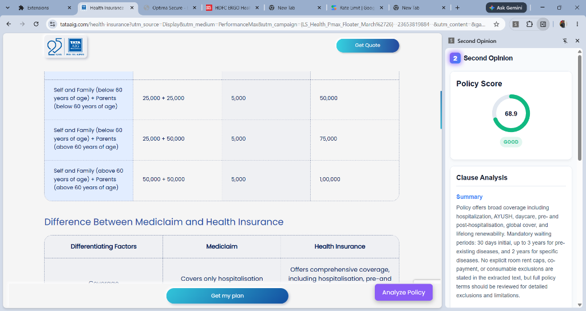
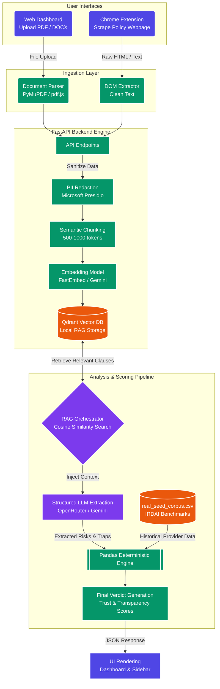

# Second Opinion

**Created by: Navonil, Puru, Shubham from BIT Mesra**

🔗 **Live Web App:** [https://second-opinion-black.vercel.app](https://second-opinion-black.vercel.app)

Second Opinion is a production-grade, end-to-end AI-powered Insurance Policy and Terms & Conditions Review Platform. It acts as a serious AI-powered policy intelligence and comparison assistant that helps users understand what they are signing up for before committing to an insurance plan. 

Whether you upload a dense 100-page policy PDF or navigate directly to a provider's marketing website, Second Opinion reads the available information, extracts critical clauses, and produces a realistic, explainable numerical assessment grounded in real data and industry benchmarks. 

Insurance providers often bury critical information—like room rent sub-limits, proportionate deductions, and obscure co-payment conditions—deep within the fine print. Second Opinion solves this by leveraging cutting-edge Retrieval-Augmented Generation (RAG) combined with a deterministic Pandas-based scoring engine to cut through the noise and give you a transparent, evidence-based score.

### 📸 Working Prototype Demo



> **Disclaimer:** This project and all testing shown is a purely conceptual prototype built for educational and demonstration purposes. The scores, analysis, and verdicts are generated by AI and do not represent a professional, legal, or financial critique of any insurance provider. The platform is designed to be fully unbiased and does not endorse or criticize any specific company.

---

## 📅 Recent System Updates (August 25, 2026)
*Author: Navonil*

Today, we rolled out a massive architectural overhaul to dramatically improve speed, stability, and intelligence across both the web app and the Chrome extension:

1. **Ultra-Fast PDF Parsing Engine**: We completely stripped out the legacy `pdfplumber` library and replaced it with a highly-optimized C++ backed engine (`PyMuPDF`). This slashed the time it takes to extract text from a massive 40-page policy document from over 60 seconds down to less than 1 second.
2. **Memory-Safe Embeddings**: We migrated the backend's semantic embedding engine from local FastEmbed models (which were causing Out-Of-Memory crashes on our cloud infrastructure) to the highly robust Cohere API (`embed-english-v3.0`). We also increased the local vector database dimension size to 1024 to properly store these premium embeddings.
3. **Advanced AI JSON Extraction**: We wrote a powerful RegEx parser to aggressively sanitize outputs from highly conversational LLM models. The backend can now flawlessly pluck structured JSON risk analysis out of any chatty model's "thinking process" without crashing.
4. **Restored Deterministic IRDAI Benchmarking**: We restored and properly mapped the `real_seed_corpus.csv` benchmark dataset. The AI no longer relies on fallback mock data; every policy score is now mathematically grounded in real-world Claim Settlement Ratios and Complaint Volumes.
5. **Seamless Extension Syncing**: We repaired the Chrome extension's build script and remapped its internal API calls to properly route traffic to the live production backend. We also modernized the web app to automatically pull the absolute latest version of the extension directly from the GitHub Releases page.

---

## 🏗️ Architecture & Technical Flow

Second Opinion is built with a unified architecture where both the Web Dashboard and the Chrome Extension share the exact same FastAPI backend engine. This ensures absolute consistency in scoring and analysis regardless of how the user accesses the platform. There are no disjointed logic paths.

### The Pipeline Architecture



### Step-by-Step Execution Flow in Detail

#### 1. Ingestion (How the platform reads the policy)
The system supports two primary modes of ingestion to maximize flexibility:
- **Web App (PDFs & DOCX)**: The user drags and drops a large PDF policy document into the React frontend. The file is uploaded to the FastAPI backend via a multipart form-data request. The backend uses PyMuPDF (or pdf.js locally in the extension) to extract raw text page by page. It does not just read the first page or the summary; it actively processes the entire document, ensuring no hidden clause is missed.
- **Chrome Extension (Websites)**: When a user visits a supported health insurance webpage (e.g., a policy details page), the extension's content script (`extractor.ts`) safely parses the DOM. It extracts meaningful text content while ignoring irrelevant navbars, footers, cookie banners, and advertisements. The raw text is packaged and sent directly to the local backend.

#### 2. Privacy & PII Redaction
Before any analysis occurs, the raw text is passed through **Microsoft Presidio**. This NLP-based engine scans the text for Personally Identifiable Information (PII) such as policyholder names, phone numbers, email addresses, and bank details. All PII is replaced with placeholders (e.g., `[REDACTED_NAME]`), ensuring absolute privacy before the data ever touches the vector database or an LLM. This guarantees that user data is never leaked to external AI providers.

#### 3. Semantic Chunking & Vectorization
Insurance policies are incredibly long and complex, often exceeding the context window of standard LLMs. The backend splits the sanitized text into smaller, overlapping "chunks" (typically 500-1000 tokens) to preserve context and ensure sentences aren't cut in half. 
- These chunks are then passed through an embedding model (like FastEmbed or Gemini) which converts the text into high-dimensional numerical vectors.
- The vectors, along with the original text metadata (like page numbers), are stored in **Qdrant**, an open-source vector database running in a local Docker container.

#### 4. Retrieval-Augmented Generation (RAG)
Instead of feeding a 100-page PDF directly into an LLM (which is expensive, slow, and highly prone to hallucinations), the system uses RAG. 
- The `RAGOrchestrator` takes predefined queries meticulously designed to find specific insurance risks (e.g., "Find clauses related to co-payments, room rent limits, exclusions, and waiting periods").
- Qdrant performs a cosine-similarity search, retrieving only the 5 or 10 most mathematically relevant chunks from the document. This ensures the LLM only looks at the exact paragraphs that matter.

#### 5. Structured LLM Extraction
The retrieved clauses are sent to the LLM (configured via OpenRouter or Gemini). Crucially, the AI is **not** asked to invent a subjective score out of thin air. Instead, it is given a strict prompt to act as an extraction engine. It reads the specific clauses and returns a structured JSON payload detailing:
- Identified risks (e.g., "20% co-payment found")
- Hidden traps (e.g., "proportionate deductions apply to room rent")
- Overall policy summary

#### 6. Deterministic Pandas Scoring Engine
This is the core of the platform's reliability. The structured data from the LLM, alongside the provider's name, is passed to a deterministic Python engine built with Pandas.
- The engine loads the `real_seed_corpus.csv`, a benchmark dataset containing actual Insurance Regulatory and Development Authority of India (IRDAI) statistics, including Claim Settlement Ratios, Claim Volumes, and Complaint Rates.
- It calculates a **Trust Score** and **Transparency Score** mathematically. For example, it starts with a base weight derived from Claim Settlement Ratios, and subtracts a fixed percentage for every hidden trap (like room rent limits) identified by the LLM.
- Missing data is handled gracefully—if a metric is not found in the CSV, it lowers the overall "Confidence" score rather than inventing a number.

#### 7. Verdict Generation & UI Rendering
The final numerical score is mapped to a deterministic verdict (e.g., 80-100 is "STRONG", 65-79 is "GOOD TO CONSIDER", 50-64 is "REVIEW CAREFULLY", and 0-49 is "HIGH RISK"). 
- The backend returns this structured JSON (Scores, Verdict, Confidence, Risk Flags) back to the frontend.
- The React Web App or the Extension Sidebar parses this data and renders the beautiful, premium light-mode dashboard, instantly showing the user a breakdown of the policy's strengths and what to watch out for.

---

## 📁 Directory Structure Breakdown

- `apps/web/`: Contains the React + Vite frontend application. It features a modern Tailwind CSS layout, native drag-and-drop file uploading, and beautiful dynamic UI components.
- `apps/extension/`: Contains the Manifest V3 Chrome Extension. It features a custom sidebar UI injected into the browser, content scripts for DOM extraction, and local PDF.js workers to process files entirely inside the browser without exposing local file paths.
- `services/backend/`: The FastAPI Python backend. This houses the RAG orchestrator (`orchestrator.py`), the Pandas scoring engine (`policy_score.py`), the PII redactor (`redactor.py`), and the API endpoints (`analysis.py`).
- `data/seed/`: Contains `real_seed_corpus.csv`, the actual benchmark dataset used to mathematically ground the scores against real-world provider statistics.

---

## 🛠️ Technology Stack

- **Frontend Web App**: React, TypeScript, Vite, Tailwind CSS (Custom Premium Light Mode Aesthetics).
- **Chrome Extension**: Manifest V3, Vanilla TypeScript, DOM parsing, local PDF.js extraction, sidePanel API.
- **Backend**: FastAPI (Python), Pydantic for strict schema validation.
- **AI & RAG**: Qdrant (Vector DB), Cohere API (Embeddings), LangChain, OpenRouter (Nemotron/Gemini).
- **Data Engine**: Pandas for deterministic scoring and benchmark comparisons.
- **Privacy & Performance**: Microsoft Presidio for NLP-based entity redaction, PyMuPDF for ultra-fast C++ document extraction.

---

## 📥 How to Download the Extension

You do not need to build the extension manually if you just want to use it! We host the latest compiled extension directly on GitHub.

1. Go to the live web app and click the **"Download Extension"** button in the top-right corner, OR navigate directly to our [GitHub Releases Page](https://github.com/navonilmandal/second-opinion/releases/latest).
2. Download the `second-opinion-extension.zip` file from the latest release.
3. Extract the downloaded zip file to a folder on your computer.
4. Open Google Chrome and navigate to `chrome://extensions/`.
5. Enable **Developer mode** using the toggle in the top right corner.
6. Click **Load unpacked** and select the folder where you extracted the extension.
7. Click on the extensions puzzle piece icon in Chrome, pin **Second Opinion**, and open the sidebar! The extension is now ready to use on any supported insurance website.

---

## 🚀 How to Run the Project Locally

To run the full architecture on your system, you will need Node.js, Python 3.10+, and Docker (for Qdrant).

### 1. Environment Configuration
Copy the `.env.example` file to `.env` in the root directory:
```bash
cp .env.example .env
```
Fill in your API keys (e.g., `COHERE_API_KEY` for embeddings, and `OPENROUTER_API_KEY` or `GEMINI_API_KEY` for analysis). The system uses Cohere by default for safe memory management, and falls back to a mock LLM if analysis keys are omitted, allowing you to test the UI without costs.

### 2. Start the Database (Qdrant)
We use Docker to run the Qdrant vector database locally:
```bash
docker run -p 6333:6333 -p 6334:6334 -v qdrant_storage:/qdrant/storage:z qdrant/qdrant
```

### 3. Start the Backend (FastAPI)
Open a terminal and navigate to the backend directory:
```bash
cd services/backend
pip install -r requirements.txt
python -m uvicorn app.main:app --host 0.0.0.0 --port 8000 --env-file ../../.env
```

### 4. Start the Frontend (React + Vite)
Open a new terminal and navigate to the web app directory:
```bash
cd apps/web
npm install
npm run dev
```

### 5. Build the Extension (Optional)
If you want to modify the extension code and rebuild it yourself:
```bash
cd apps/extension
npm install
npm run build
```
The compiled extension will be placed in `apps/extension/dist`.

---

## 🚧 Bottlenecks & Future Improvements

While Second Opinion is a fully functional and robust prototype, there are a few bottlenecks in the current architecture that we plan to address to evolve this into a truly enterprise-grade platform:

### Current Limitations
1. **Limited Benchmark Dataset:** Currently, the `real_seed_corpus.csv` contains a relatively small sample of providers. The scoring engine relies on this dataset for its Trust and Transparency scores. Because the dataset is small, the "Market Percentile" calculation is limited in its scope.
2. **Free-Tier API Rate Limits:** The platform is currently configured to use free-tier LLM endpoints (like Gemini or OpenRouter's free models) for the RAG extraction. These APIs impose strict rate limits (requests per minute), which can occasionally cause the analysis to fail if multiple users scan large PDFs simultaneously.
3. **Complex PDF Layouts:** While PyMuPDF is excellent, extremely unstructured PDFs with multi-column layouts or image-heavy scans without OCR can occasionally result in imperfect text extraction, slightly reducing the effectiveness of the semantic chunking.

### The Path to Greatness (Roadmap)
To make Second Opinion the absolute greatest policy review platform in the world, the following upgrades are planned:

- **Massive Data Expansion:** Scrape and integrate the entire, up-to-date IRDAI database covering all health, life, and motor insurance providers across India to create an exhaustive, nationwide benchmark dataset.
- **Enterprise LLM Integration:** Transition from free-tier APIs to a dedicated, high-throughput model (like fine-tuned Llama 3 on Groq or OpenAI's GPT-4o-mini). This will eliminate rate limiting and allow for split-second, highly complex reasoning across 100+ page documents.
- **Visual OCR & Layout Parsing:** Upgrade the ingestion pipeline to use Vision-Language Models (VLMs) or advanced OCR (like AWS Textract or Unstructured.io) to perfectly preserve tables, columns, and graphical caveats in policies.
- **User-Specific Memory:** Implement persistent user accounts where users can save their health profiles (e.g., age, pre-existing conditions) so the RAG engine can dynamically highlight whether a policy is specifically good or bad *for them*, rather than just a general assessment.
